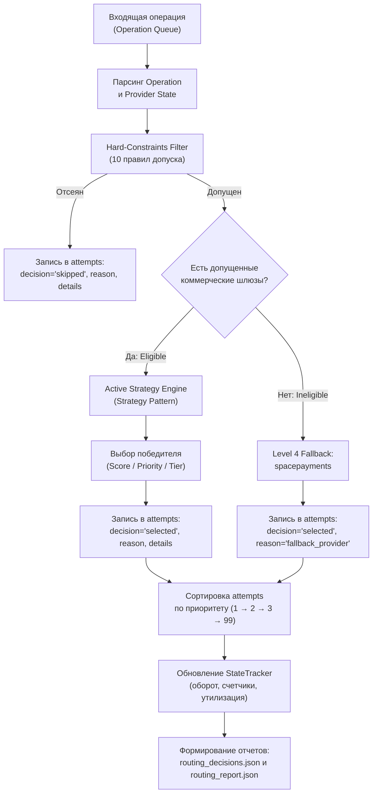

# Умный роутинг выплат (Smart Payout Router)

Production-ready сервис интеллектуальной маршрутизации выплат между платёжными провайдерами на **чистом Ruby** (без сторонних гемов, только стандартные библиотеки `json` и `date`).

Сервис решает задачу оптимального распределения выплатного потока в условиях жестких финансовых ограничений (Hard-constraints), контрактных квот (Traffic & Volume Share), различий в банковской надежности (Bank Success Rate) и предотвращения зависаний (Timeout Penalties).

---

## 1. Архитектура решения

Решение построено по канонам чистой модульной архитектуры с разделением зон ответственности:

```
Genesis_2026/
├── lib/
│   ├── models/
│   │   ├── provider.rb               # Модель провайдера, паспортные данные и изменяемый StateTracker
│   │   └── operation.rb              # Модель входящей операции / заявки на выплату
│   ├── filters/
│   │   └── hard_constraints_filter.rb# 10 детерминированных правил отсечения (Hard-constraints)
│   ├── strategies/
│   │   ├── base_strategy.rb          # Базовый интерфейс паттерна Strategy
│   │   ├── priority_cascade_strategy.rb # Детерминированный каскад по приоритету
│   │   └── scoring_strategy.rb       # Адаптивный мультифакторный скоринг и альтернативные стратегии
│   ├── engine/
│   │   └── payment_router.rb         # Главный движок координации, аудит попыток (attempts) и fallback
│   └── analytics/
│       └── report_generator.rb       # Аналитический движок, расчет утилизации и генератор рекомендаций
├── config.json                       # Конфигурация стратегии по умолчанию и весов скоринга
├── router.rb                         # Главный исполняемый скрипт (CLI)
├── scripts/
│   └── validate_10.rb                # Скрипт проверки детерминированных кейсов и схемы данных
└── README.md                         # Архитектурное и аналитическое описание решения
```

### Схема движения заявки (Data Flow)



---

## 2. Логика маршрутизации

### 2.1. Пайплайн обработки операций
1. **Инициализация:** Загрузка `providers.json` с созданием изолированных сущностей `Provider`.
2. **Проверка Hard-constraints:** Для каждой транзакции все коммерческие провайдеры (отсортированные по приоритету) проверяются на удовлетворение 10 обязательных условий.
3. **Маршрутизация:**
   - Если один или более коммерческих провайдеров допущены, активная стратегия выбирает наилучшего.
   - Если все коммерческие партнеры отклонили заявку, транзакция направляется на аварийный шлюз `spacepayments`.
4. **Аудит попыток (`attempts`):** Детерминированное упорядочивание всех шагов рассмотрения с фиксацией стандартизированной причины (`reason`) и подробностей (`details`).
5. **Мутация состояния (`StateTracker`):** Атомарное обновление `daily_approved_amount`, `processed_count` и `processed_volume` победителя.
6. **Симуляция исполнения:** Фиксация статуса `"simulated_result": "approved"` и реалистичной задержки `latency_sec` (в диапазоне 15..60 секунд).

### 2.2. Математические формулы скоринга и стратегий

В решении реализован паттерн **Strategy** с возможностью переключения через `config.json`, переменную окружения `ROUTING_STRATEGY` или CLI-аргумент:

#### 1. `priority_cascade` (Детерминированный каскад)
Провайдеры из списка допустимых сортируются по полю `priority`. Выбирается провайдер с минимальным рангом:
- Если подошел ровно один: `reason: "only_eligible_provider"`
- Если несколько: `reason: "first_eligible"`

#### 2. `traffic_share_balanced` (Балансировка по количеству операций)
Максимизируется текущий дефицит целевой доли операций:
$$\Delta_{\text{count}}(P) = \text{TargetCountShare}(P) -  \frac{\text{ProcessedCount}(P)}{\text{TotalOperations}} \times 100\% $$

#### 3. `volume_share_balanced` (Балансировка по денежному объему)
Максимизируется текущий дефицит целевого оборота:
$$\Delta_{\text{vol}}(P) = \text{TargetVolumeShare}(P) -  \frac{\text{ProcessedVolume}(P)}{\text{TotalVolume}} \times 100\%  $$

#### 4. `amount_tiered` (Сегментация по суммам чеков)
- Сумма $\le 50\,000$ ₽: приоритетно направляется в `payflow` (сберегая лимиты конкурентов).
- Сумма $50\,001$ – $100\,000$ ₽: направляется в `vipay`.
- Сумма $> 100\,000$ ₽: направляется в `quickpay`.
- Если профильный шлюз не проходит Hard-constraints, каскадируется на следующего доступного.

#### 5. `hybrid_adaptive` (Мультифакторный адаптивный скоринг — ОСНОВНАЯ)
Для каждого eligible-провайдера вычисляется агрегированный взвешенный скор:

$$\text{Score}(P) = w_{\text{count}} \cdot \Delta_{\text{count}}(P) + w_{\text{vol}} \cdot \Delta_{\text{vol}}(P) + w_{\text{conv}} \cdot \text{SR}(P, \text{bank}) - w_{\text{util}} \cdot \text{UtilRate}(P) - w_{\text{prio}} \cdot \text{Priority}(P) - \text{Penalties}$$

Где:
- $\text{SR}(P, \text{bank})$ — эмпирическая матрица успешности (Success Rate) провайдера на конкретном банке получателя (извлечена из `operations_history.csv`).
- $\text{UtilRate}(P) = \frac{\text{DailyApprovedAmount}(P)}{\text{DailyAmountLimit}(P)}$ — текущая доля выработки дневного лимита.
- $\text{Penalties}$ — штрафные коэффициенты иерархии разрешения конфликтов.

### 2.3. Иерархия разрешения конфликтов (Arbitration Hierarchy)

| Уровень | Контур проверки | Правило и штрафные санкции |
|:---:|---|---|
| **Level 1** | **Hard-constraints** | Абсолютное отсечение. Нарушение лимита чека, дневного лимита, отсутствие банка в whitelist или нехватка реквизитов исключают провайдера из рассмотрения. |
| **Level 2** | **Финансовые лимиты** | Если утилизация дневного лимита $\text{UtilRate}(P) > 0.85$, накладывается жесткий штраф ($\text{Penalty} = -50.0$), предотвращающий аварийное исчерпание емкости до конца дня. |
| **Level 3** | **Банковская надежность** | Если исторический $\text{SR}(P, \text{bank}) < 0.30$, провайдер штрафуется ($\text{Penalty} = -50.0$). Это предотвращает зависания и таймауты (например, Payflow на Тинькофф и Альфа-Банке). |
| **Level 4** | **Выравнивание квот** | При равной надежности приоритет отдается провайдеру с максимальным отставанием от контрактной квоты ($\Delta_{\text{count}}$ и $\Delta_{\text{vol}}$). |
| **Fallback**| **Аварийный шлюз** | Если все коммерческие провайдеры отсеяны на Level 1, выплата направляется на `spacepayments` (`reason: "fallback_provider"`). |

---

## 3. Эмпирическое обоснование архитектуры и весов (Data-Driven Insights)

Анализ 100 исторических операций (`data/operations_history.csv`) и снапшота провайдеров (`data/providers.json`) выявил ключевые структурные дисбалансы:

### 3.1. Обоснование отказа от статического `conversion_24h`
В `providers.json` указана паспортная конверсия `conversion_24h = 0.91` для `payflow`. Однако фактический анализ истории показал катастрофический разрыв:

| Провайдер | Паспортная конверсия | Фактический SR (Approved) | Expired (%) | Разрыв факт/паспорт |
|---|:---:|:---:|:---:|:---:|
| **payflow** | 91.0% | **47.37%** (9 из 19) | **36.84%** (7 из 19) | **-43.63 п.п.** |
| **quickpay** | 79.0% | **67.50%** (27 из 40) | **15.00%** (6 из 40) | -11.50 п.п. |
| **vipay** | 87.0% | **78.05%** (32 из 41) | **7.32%** (3 из 41) | -8.95 п.п. |

**Вывод:** Использование статического `conversion_24h` приводит к ошибочному направлению трафика в Payflow. В `hybrid_adaptive` скоринге используется **эмпирическая матрица конверсии по банкам $\text{SR}(P, \text{bank})$**, где Payflow на Сбере имеет 100%, но на Альфа-Банке — лишь 28.6%, а на Тинькофф — 0%.

### 3.2. Обоснование структурного перекоса `quickpay`
- Квота `quickpay`: **25%**.
- Фактическая историческая доля: **40.0% операций** и **55.58% оборота** (+30.58 п.п. перекоса по объему).

**Причина аномалии:**
Банки **Газпромбанк** (10% входящего потока) и **Райффайзенбанк** (18% входящего потока) суммарно составляют **28.0% всех операций** и **27.2% объема**. Ни `vipay`, ни `payflow` эти банки не поддерживают. В результате Quickpay монопольно забирает 28% всего трафика только за счет банковского фильтра, что делает удержание его в квоте 25% математически невозможным без сброса в fallback.

### 3.3. Обоснование ценовой сегментации (Amount Tiering)
- 26% чеков во входящем потоке превышают 50 000 ₽.
- Максимальный лимит `payflow` — строго 50 000 ₽.
- Таким образом, **26% всего трафика физически недоступны для Payflow**.
- Из оставшихся 74% Payflow должен забирать почти половину, чтобы выполнить свою квоту 35%. Именно поэтому чеки диапазона 500–50 000 ₽ должны приоритетно резервироваться под Payflow.

---

## 4. Команды запуска
Запуск с путями по умолчанию (`data/providers.json`, `data/operations_queue_10.json`, формирование `routing_decisions.json` и `routing_report.json`):
```bash
ruby router.rb
```

Запуск с явной передачей путей:
```bash
ruby router.rb data/providers.json data/operations_queue_10.json routing_decisions.json routing_report.json
```

Запуск с выбором стратегии (`priority_cascade`, `hybrid_adaptive`, `amount_tiered`, `traffic_share_balanced`, `volume_share_balanced`):
```bash
ruby router.rb data/providers.json data/operations_queue_10.json routing_decisions.json routing_report.json hybrid_adaptive
```
